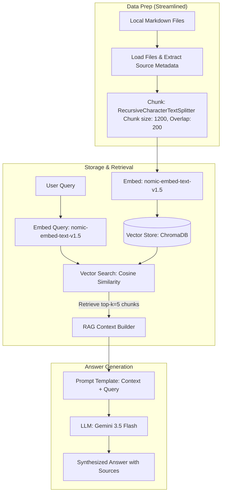

# Project 1 Planning: The Unofficial Guide

> Write this document before you write any pipeline code.
> Your spec and architecture diagram are what you'll use to direct AI tools (Claude, Copilot, etc.) to generate your implementation — the more specific they are, the more useful the generated code will be.
> Update the Retrieval Approach and Chunking Strategy sections if you change your approach during implementation.
> Update this file before starting any stretch features.

---

## Domain

<!-- What domain did you choose? Why is this knowledge valuable and hard to find through official channels? -->
The domain I chose is retail investors' discussion of stocks. This knowledge is valuable and hard to find through official channels because traditional financial reports contain jargon and does not capture the behaviors of masses. Retail discussion on channels like reddit offer organic data of everyday shares showing real-time sentiment, emotional reaction, personal experience, and perspective that are absent in mainstream reporting.

---

## Documents

<!-- List your specific sources: URLs, subreddit names, forum threads, or file descriptions.
     Aim for at least 10 sources that together cover different subtopics or perspectives within your domain. -->

| # | Source | Description | URL or location |
|---|--------|-------------|-----------------|
| 1 | Reddit | Amazon is considering abandoning the USPS and establishing a competing postal service. | https://www.reddit.com/r/stocks/comments/1pe5t5i/amazon_is_considering_abandoning_the_usps_and/ |
| 2 | Reddit | Reddit stock drops 6% after Meta announces a Facebook Groups app | https://www.reddit.com/r/stocks/comments/1tl1m3q/reddit_stock_drops_6_after_meta_announces_a/ |
| 3 | Reddit | BlackBerry (BB) isn’t about Smartphones anymore. | https://www.reddit.com/r/stocks/comments/1tn0giy/blackberry_bb_isnt_about_smartphones_anymore/ |
| 4 | Reddit | Getting out of Palantir | https://www.reddit.com/r/stocks/comments/1s2t7ys/getting_out_of_palantir/ |
| 5 | Reddit | I’ve had AMD since 2023 and just sold | https://www.reddit.com/r/stocks/comments/1nzk4mm/ive_had_amd_since_2023_and_just_sold/ |
| 6 | Reddit | Microsoft freefall | https://www.reddit.com/r/stocks/comments/1s5d4l7/microsoft_freefall/ |
| 7 | Reddit | This is a disaster of epic proportion” Trump vs. Musk turns into a $150B Tesla bloodbath | https://www.reddit.com/r/stocks/comments/1l56hgo/this_is_a_disaster_of_epic_proportion_trump_vs/ |
| 8 | Reddit | Trump's Japan tariffs actually harm US auto companies, like $F and $GM. | https://www.reddit.com/r/stocks/comments/1mcbijm/trumps_japan_tariffs_actually_harm_us_auto/ |
| 9 | Reddit | GOOGL up 130% since April lows ... why do you think it’s climbing so fast? | https://www.reddit.com/r/stocks/comments/1p67m4g/googl_up_130_since_april_lows_why_do_you_think/ |
| 10 | Reddit | Okay Micron has gone crazy | https://www.reddit.com/r/stocks/comments/1tod7ce/okay_micron_has_gone_crazy/ |

---

## Chunking Strategy

<!-- How will you split documents into chunks?
     State your chunk size (in tokens or characters), overlap size, and explain why those
     numbers fit the structure of your documents.
     A review-heavy corpus warrants different chunking than a long FAQ. -->

**Chunk size:**
Determined to be chuck size of 400 after finding there were less than 50 chunks. Ignore initial: The posts are usually a few paragraphs. They are not considered short so they are medium to large chunk sizes, from 800-1200 characters so chunk size of 1000 characters.

**Overlap:**
Determine to use an overlap of 75. Ignore initial: An overlap of 150 character chuck would fit the structure of the documents.

**Reasoning:**
Intial thought: 1000 characters will fit the entire shorter post in a single chunk while longer posts are divided to two chunks. An overlap of 150 will ensure a post split into two chunks maintain semantic continuity.
Concluded: I cut both chunk and overlap by half after seeing the total chunks produced. The random chunks looked fine but each chunk was covering too much ground.

---

## Retrieval Approach

<!-- Which embedding model are you using (e.g., all-MiniLM-L6-v2 via sentence-transformers)?
     How many chunks will you retrieve per query (top-k)?
     If you were deploying this for real users and cost wasn't a constraint, what tradeoffs
     would you weigh in choosing a different embedding model — context length, multilingual
     support, accuracy on domain-specific text, latency? -->

**Embedding model:**
all-MiniLM-L6-v2

**Top-k:**
5

**Production tradeoff reflection:**
Using a symmetric sentence-similarity mode without needing to distinguish between search queries and documents. 

---

## Evaluation Plan

<!-- List your 5 test questions with their expected correct answers.
     Questions should be specific enough that you can judge whether the system's response
     is right or wrong. "What are good dining halls?" is too vague.
     "What do students say about wait times at [dining hall name] during lunch?" is testable. -->

| # | Question | Expected answer |
|---|----------|-----------------|
| 1 | What did Ross Gerber call Elon Musk's actions and TSLA's recent stock moves? | Ross Gerber called it a "disaster." Tesla's stock dropped 14% in one day, wiping out $150B in market cap. |
| 2 | What does BlackBerry do today? | They make a software called QNX, it is currently installed in 275 million vehicles. |
| 3 | What do people really think about Meta new move with forum? | People think Facebook have been around for decades but did not affect how people used Reddit. |
| 4 | Why does retail want to get out of Palantir? | People from Reddit believes Palantir is generally bad for humanity and dislikes their stock dilution practices. |
| 5 | What do people think about Trump's 15% tariffs on cars imported from Japan related to US auto companies? | It harms them because Ford and GM import critical parts and entire vehicles from their Japanese subsidiaries/joint ventures, meaning they will pay the tariffs themselves. |

---

## Anticipated Challenges

<!-- What could go wrong? Name at least two specific risks with reasoning.
     Consider: noisy or inconsistent documents, missing source attribution, off-topic
     retrieval, chunks that split key information across boundaries. -->

1. **Pronoun Resolution and Context Loss (Entity Disconnection)**
   - *Reasoning:* Reddit posts are highly conversational, statistics and things said as a fact may not be true. Often the company name (e.g., "Palantir" or "Micron") only once in the title or introduction, and then refers to it using pronouns ("they," "their," "this company") or uses the ticker. If a document is chunked, the middle/later chunks will contain critical facts without naming the entity, causing the vector search to miss them for entity-specific queries.

2. **Conflicting Sentiments and Market Noise**
   - *Reasoning:* The corpus contains contradictory perspectives on the same stock (e.g., one post describing a Microsoft "freefall" and another post showing DCA bullishness). A vector search might retrieve both bullish and bearish chunks for a query about MSFT's outlook. Without strict generation instructions, the LLM may output contradictory summaries or struggle to evaluate the conflicting perspectives objectively.

---

## Architecture

<!-- Draw a diagram of your pipeline showing the five stages:
     Document Ingestion → Chunking → Embedding + Vector Store → Retrieval → Generation
     Label each stage with the tool or library you're using.
     You can use ASCII art, a Mermaid diagram, or embed a sketch as an image.
     You'll use this diagram as context when prompting AI tools to implement each stage. -->

---

## AI Tool Plan

<!-- For each part of the pipeline below, describe:
     - Which AI tool you plan to use (Claude, Copilot, ChatGPT, etc.)
     - What you'll give it as input (which sections of this planning.md, which requirements)
     - What you expect it to produce
     - How you'll verify the output matches your spec

     "I'll use AI to help me code" is not a plan.
     "I'll give Claude my Chunking Strategy section and ask it to implement chunk_text()
     with my specified chunk size and overlap" is a plan. -->

**Milestone 3 — Ingestion and chunking:**
I plan to use Claude and Gemini to extract the saved Reddit post or write a query to pull from Reddit API for the specific posts. I will prompt AI to implement randomness to chunk the 5 chunks to see how the planning.md and adjust. I don't plan to feed the instruction work by work, instead I give it a specific task. Then I take the AI produced code and outputs I can review how well it is meeting the specifics of the instructions. There are checkpoints and bullpoints that describes what I should expect so if the AI is not producing that, I adjust and learn what I can do better in prompting.

**Milestone 4 — Embedding and retrieval:**

**Milestone 5 — Generation and interface:**
